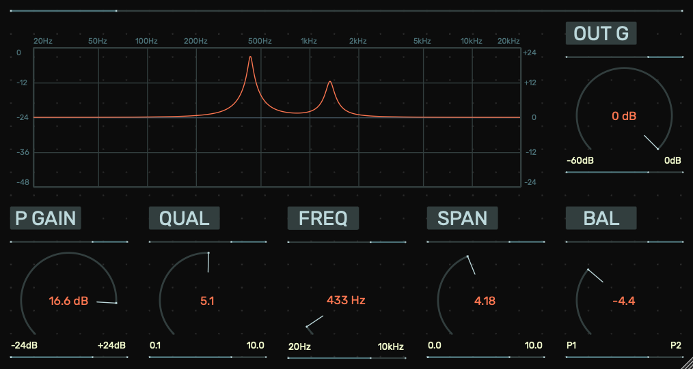

# Simple Dual Peak Filter

## Overview

This project is a **Dual Filter Plugin** built using the **JUCE framework**. It controls two filters with a single frequency parameter. The main goal was to learn JUCE and create a practical tool for my workflow.

## Features

- **P GAIN**: Tweak the gain of the filters to boost or to cut by 24dB.
- **QUAL**: Adjust how narrow or wide the frequency band is around the center frequency.
- **FREQ**: Adjust the two filters simultaneously with a single frequency knob.
- **SPAN**: Adjust the frequency of the second peak filter in relation to the frequency of the first peak filter.
- **BAL**: Set the balance between the two filters.
- **OUT G** : Adjust the output gain.
- **Real-time Visualization**: See filter curves update live.
- **Resizable Interface**: The UI scales to fit any window size.

Parts of the plugin are inspired by a tutorial by matkatmusic.

Feel free to explore the source code and see how the plugin was built!
